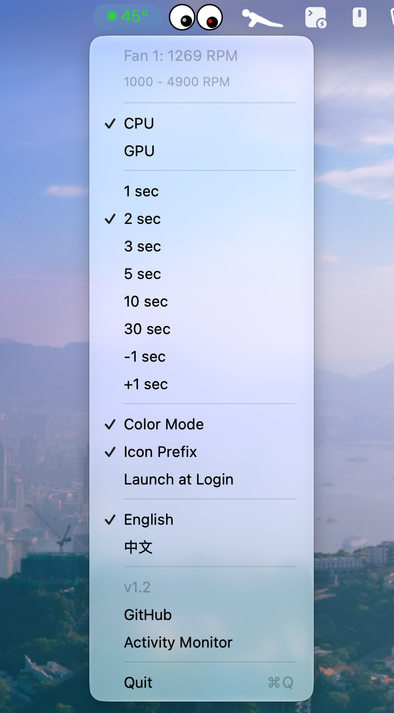

# SwiftTempBar

> Built with GLM-5.1 / GLM-5.2 (OpenCode) Vibe Coding.

[中文文档](README_CN.md)

A lightweight macOS menu bar temperature monitor for Apple Silicon (M-series chips).



## Features

- Real-time CPU / GPU temperature display in the menu bar
- Switchable CPU and GPU mode
- Color-coded temperature display (optional):
  - Blue: < 35°C (Low)
  - Green: 35–45°C (Normal)
  - Orange: 46–55°C (High)
  - Red: ≥ 56°C (Overheating)
- Icon prefix mode (optional) — colored dot ● before temperature for better visibility
- Fan speed display with RPM range (read on menu open)
- One-click open Activity Monitor
- One-click open GitHub repository
- Version label in menu
- Configurable refresh interval with presets (1s / 2s / 3s / 5s / 10s / 30s) and fine-tuning (±1s)
- Settings persistence across restarts
- Launch at login option
- English / Chinese menu language switch (defaults to English)
- No Dock icon — lives entirely in the menu bar

## Requirements

- macOS 13.0 (Ventura) or later
- Apple Silicon Mac (M1 / M2 / M3 / M4 series)

## How It Works

SwiftTempBar reads hardware temperature sensors through macOS private IOKit/HID APIs, and fan speed through the Apple SMC (System Management Controller):

### Temperature

1. **IOHIDEventSystemClientCreate** — creates a HID system client
2. **IOHIDEventSystemClientSetMatching** — filters devices by `UsagePage=0xFF00, Usage=5` (temperature sensors)
3. **IOHIDEventSystemClientCopyServices** — enumerates all matching sensor services
4. **IOHIDServiceClientCopyProperty** — reads each sensor's name ("Product")
5. **IOHIDServiceClientCopyEvent** — retrieves a temperature event (`kIOHIDEventTypeTemperature = 15`)
6. **IOHIDEventGetFloatValue** — extracts the temperature value

Sensors are classified by name prefix:
- **CPU**: `PMU tdie`, `PMU tdev`, `pACC MTR Temp`, `eACC MTR Temp`, etc.
- **GPU**: `GPU MTR Temp Sensor`, `PMU2 tdie`, `PMU2 tdev`, etc.

The private APIs are loaded at runtime via `dlopen`/`dlsym` — no bridging headers or ObjC needed.

### Fan Speed

1. **IOServiceMatching("AppleSMC")** — opens a connection to the SMC service
2. **IOConnectCallStructMethod** — sends SMC commands (read key info / read bytes)
3. **FNum** — reads fan count (`ui8` type)
4. **F%dAc / F%dMn / F%dMx** — reads current / minimum / maximum RPM per fan (`flt` or `fpe2` type)

## Project Structure

```
Sources/
├── StatusBarController.swift   # App entry (@main), menu bar UI, settings
├── TemperatureReader.swift     # HID sensor reading (pure Swift)
├── FanReader.swift             # SMC fan speed reading (pure Swift)
├── Assets.xcassets/            # App icon
└── Info.plist
```

Only 3 Swift source files. No Storyboards, no ObjC, no dependencies.

## Building

```bash
xcodebuild -project SwiftTempBar.xcodeproj -scheme SwiftTempBar -configuration Release build
```

## Acknowledgements

This project was inspired by and derived from:

- [SolitaryJune/TempBarApp](https://github.com/SolitaryJune/TempBarApp) (BSD-3)
- [Cliffback/macos-temp-tool](https://github.com/Cliffback/macos-temp-tool) (BSD-3)
- [freedomtan/sensors](https://github.com/freedomtan/sensors) (BSD-3)

## License

See [LICENSE](LICENSE).
