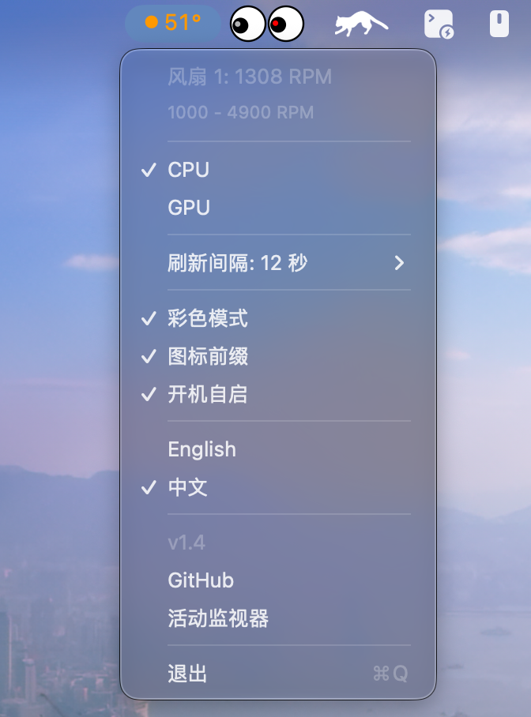

# SwiftTempBar

> 由 GLM-5.1 / GLM-5.2 (OpenCode) Vibe Coding 而成。

一个轻量级的 macOS 菜单栏温度监控工具，专为 Apple Silicon（M 系列芯片）设计。



## 功能特性

- 菜单栏实时显示 CPU / GPU 温度
- 可切换 CPU 和 GPU 显示模式
- 彩色温度显示（可选）：
  - 蓝色：< 35°C（低温）
  - 绿色：35–45°C（正常）
  - 橙色：46–55°C（偏高）
  - 红色：≥ 56°C（过热）
- 图标前缀模式（可选）——温度前显示彩色圆点 ●，提升辨识度
- 风扇转速显示，含 RPM 范围（打开菜单时读取）
- 一键打开系统活动监视器
- 一键打开 GitHub 仓库
- 菜单内显示版本号
- 可配置刷新间隔，提供预设（1秒 / 2秒 / 3秒 / 5秒 / 10秒 / 15秒 / 30秒 / 45秒 / 60秒）及微调（±1秒）
- 设置自动持久化，重启后保留
- 开机自启选项
- 中英文菜单语言切换（默认英文）
- 无 Dock 图标，仅驻留菜单栏

## 系统要求

- macOS 13.0 (Ventura) 及以上
- Apple Silicon Mac（M1 / M2 / M3 / M4 系列）

## 实现原理

SwiftTempBar 通过 macOS 私有 IOKit/HID API 读取硬件温度传感器，通过 Apple SMC（系统管理控制器）读取风扇转速：

### 温度

1. **IOHIDEventSystemClientCreate** — 创建 HID 系统客户端
2. **IOHIDEventSystemClientSetMatching** — 按 `UsagePage=0xFF00, Usage=5` 过滤温度传感器
3. **IOHIDEventSystemClientCopyServices** — 枚举所有匹配的传感器服务
4. **IOHIDServiceClientCopyProperty** — 读取传感器名称（"Product"）
5. **IOHIDServiceClientCopyEvent** — 获取温度事件（`kIOHIDEventTypeTemperature = 15`）
6. **IOHIDEventGetFloatValue** — 提取温度浮点值

传感器按名称前缀分类：
- **CPU**：`PMU tdie`、`PMU tdev`、`pACC MTR Temp`、`eACC MTR Temp` 等
- **GPU**：`GPU MTR Temp Sensor`、`PMU2 tdie`、`PMU2 tdev` 等

私有 API 通过 `dlopen`/`dlsym` 在运行时动态加载，无需桥接头文件或 ObjC。

### 风扇转速

1. **IOServiceMatching("AppleSMC")** — 打开 SMC 服务连接
2. **IOConnectCallStructMethod** — 发送 SMC 命令（读取键信息 / 读取数据）
3. **FNum** — 读取风扇数量（`ui8` 类型）
4. **F%dAc / F%dMn / F%dMx** — 读取每个风扇的当前 / 最小 / 最大转速（`flt` 或 `fpe2` 类型）

## 项目结构

```
Sources/
├── StatusBarController.swift   # 应用入口（@main）、菜单栏 UI、设置管理
├── TemperatureReader.swift     # HID 传感器读取（纯 Swift）
├── FanReader.swift             # SMC 风扇转速读取（纯 Swift）
├── Assets.xcassets/            # 应用图标
└── Info.plist
```

仅 3 个 Swift 源文件，无 Storyboard、无 ObjC、无第三方依赖。

## 构建

```bash
xcodebuild -project SwiftTempBar.xcodeproj -scheme SwiftTempBar -configuration Release build
```

## 致谢

本项目灵感来源于并衍生自以下项目：

- [SolitaryJune/TempBarApp](https://github.com/SolitaryJune/TempBarApp) (BSD-3)
- [Cliffback/macos-temp-tool](https://github.com/Cliffback/macos-temp-tool) (BSD-3)
- [freedomtan/sensors](https://github.com/freedomtan/sensors) (BSD-3)

## 许可证

参见 [LICENSE](LICENSE)。
